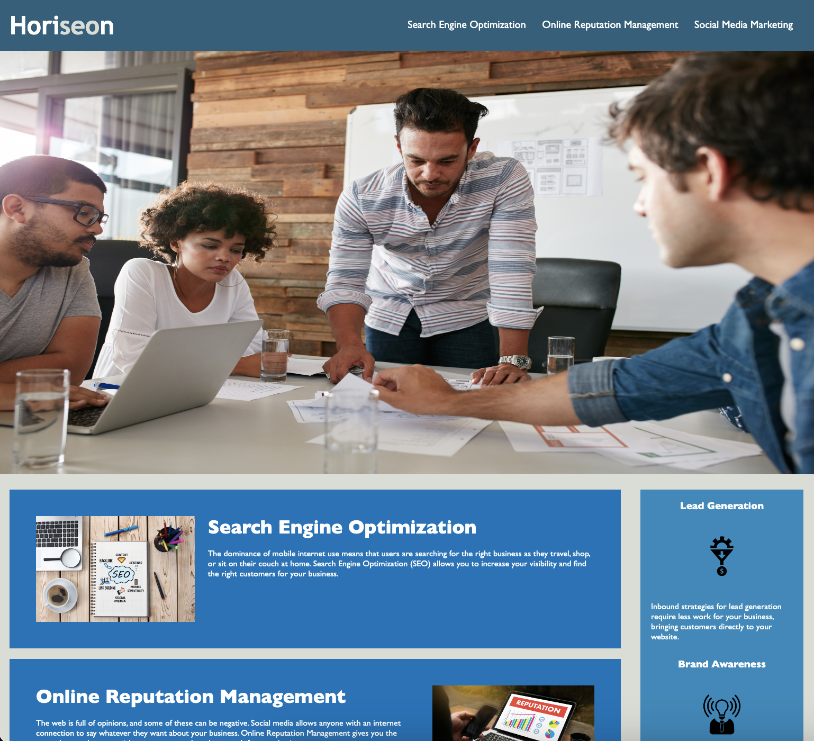

# Horiseon

SEO marketing website can be viewed [here](https://leannecodes.github.io/market-website-refactor/).

## Description

The aim was to refactor a website, so that it met accessibility standards and consolidated the CSS, so that it was easier to read.

## Application Appearance

## Credits

EdxOnline Skills Bootcamp for the starter code that needed to be refactored.